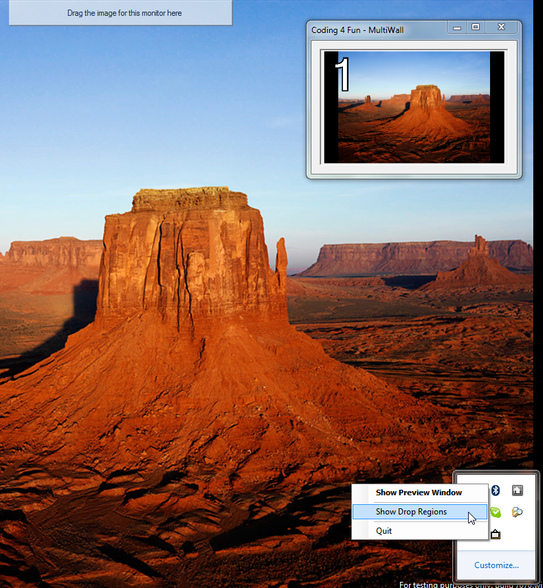

# c4f-multiwall
MSDN - C4F - Multi-Monitor Wallpaper\
_Imported from [CodePlex](https://archive.codeplex.com/?p=multiwall) archive_

**Project Description**  
Do you wish that it was easier to have different wallpapers on each desktop? Multi-Monitor Wallpaper (MultiMon) lets you drag-and-drop a photo to a region on each desktop. Then it resizes it to show the whole image without stretching or cropping. (MSDN Coding 4 Fun)  

## Introduction

Are you more productive with more monitors? Would you be even more productive with better wallpaper management? I thought so\! In this project, see how to create a utility to manage your Windows desktop wallpaper with separate images per screen. It's addicting\!  
  
Everyone enjoys customizing his or her computer to the extent possible, and this almost always includes the desktop wallpaper. Windows manages wallpaper resizing pretty transparently, increasing or reducing the image display size, or tiling it as specified. Unfortunately, this isn't quite as smooth if you have more than one monitor. After some tinkering around with display settings and different bitmaps, I threw together a utility to resize images easily so you can customize what shows on each display. This has been tested up to Windows 7 RC1.  

## Usage

Using MultiWall couldn't be easier. When you first launch it you get several things. On your primary desktop you'll get a preview window. Each monitor will be represented in this window, in their relative positions. This window serves no purpose except as a quick global preview, and an exercise in coding.  
  
  
  
At the top-center of each monitor, you'll have a small drop-zone.  
  
  
  
Just drop an image file onto this zone to replace the image on that monitor. After doing so, the main preview window will update accordingly  
  
Use the context-menu settings to disable either the drop-zone or preview windows. That's it\!  
  
If the desktop configuration changes *while* MultiWall is running, it will resize images accordingly. If not, they will look very bad\! This is due to how you must place the images for them to layout on the screens properly. Read the [article](https://channel9.msdn.com/coding4fun/articles/MultiWall-Wallpaper-Tool-for-Multiple-Monitors) for more info. Let me know if you would like commit permissions.  
  
  

## Known Limitations

This is not a perfect project by far. It was written as sample code, so could use some work. For one thing, the preview window is blank if you restart the app. For that matter, the preview window should really work as a drag-and-drop area too, or it could just be removed. Just not much point. It might also be nice to have settings for zoom-to-fill vs. zoom-to-fit.

Note: This code was originally published as part of an MSDN Coding 4 fun [article](https://channel9.msdn.com/coding4fun/articles/MultiWall-Wallpaper-Tool-for-Multiple-Monitors).